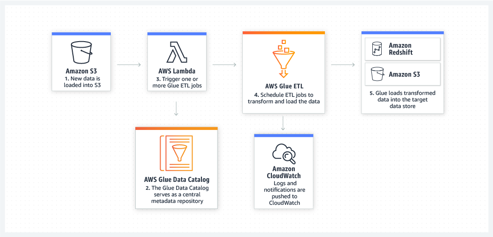

# AWS Glue (serverless ETL for Data stored in AWS)
- AWS Glue is a fully managed extract, transform, and load (ETL) service that makes it easy for customers to prepare and load their data for analytics.

- AWS Glue natively supports data stored in Amazon Aurora and all other Amazon RDS engines, Amazon Redshift, and Amazon S3, as well as common database engines and databases in your Virtual Private Cloud (Amazon VPC) running on Amazon EC2.

- You simply point AWS Glue to your data stored on AWS, and AWS Glue discovers your data and stores the associated metadata (e.g. table definition and schema) in the AWS Glue Data Catalog. Once cataloged, your data is immediately searchable, queryable, and available for ETL

# How it works
- Build your Data Catalog
- Generate and Edit Transformations
- Schedule and Run Your Jobs    

## Use Cases

- Queries Against an Amazon S3 Data Lake
| |
| :------------- |
| Glue Queries Against S3 Data Lake       |

- Analyze Log Data in Your Data Warehouse
| |
| :------------- |
| Analyze Log Data in Your Data Warehouse      |

- Unified View of Your Data Across Multiple Data Stores
| |
| :------------- |
| Unified View of Your Data Across Multiple Data Stores  |

- Event-driven ETL Pipelines
| |
| :------------- |
| Event-driven ETL Pipelines  |
