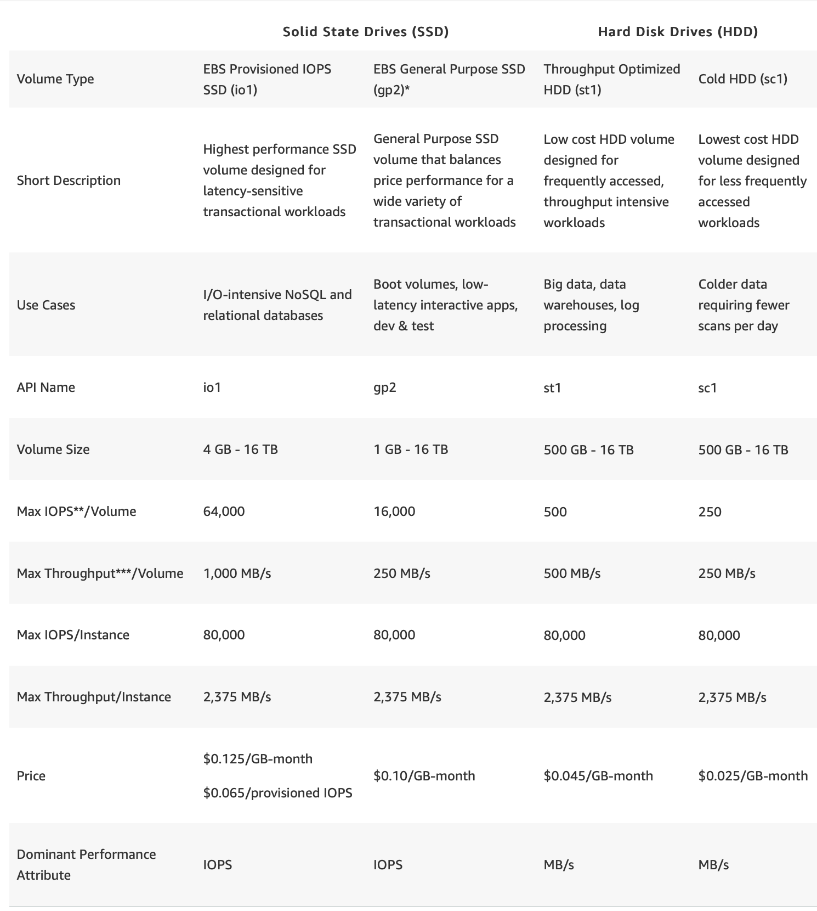

# EBS

## Volume Types

- `Only EBS-backed instances can be stopped and restarted`.
- Remember that an `instance store-backed instance can only be rebooted` or terminated and its data will be erased if the EC2 instance is terminated.
- If you stopped an `EBS-backed EC2 instance`, the volume is preserved but the `data in any attached Instance store` volumes will be erased. (Implies that EBS-Backed instance can have instance store volumes attached it.)
