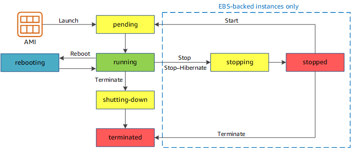
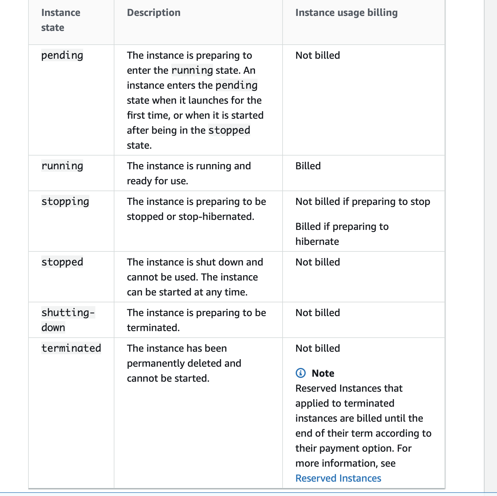

# EC2 (Elastic Cloud Compute)

- Remember that an instance store-backed instance can only be `rebooted or terminated` and its data will be erased if the EC2 instance is terminated.
-  If you stopped an EBS-backed EC2 instance, the volume is preserved but the data in any attached Instance store volumes will be erased.
- Keep in mind that an EC2 instance has an underlying physical host computer. If the instance is stopped, AWS usually moves the instance to a new host computer. Your instance may stay on the same host computer if there are no problems with the host computer.In addition, its `Elastic IP address is disassociated` from the instance if it is an EC2-Classic instance. Otherwise, if it is an `EC2-VPC instance, the Elastic IP address remains associated`.

-Take note that an EBS-backed EC2 instance can have attached Instance Store volumes.

### Instance lifecycle

### Which state C2 Instance will incur charges

- Running
  - If The instance is `running` and ready for use then it is `Billed`
- Stopping
  - If The instance is preparing to be stopped or stop-hibernated.
    - `Not billed` if preparing to stop
    - `Billed` if preparing to hibernate

- All Other States
  - `Not Changed`

#### Note : RESERVED INSTANCE ARE STILL BILLED IF THEY ARE TERMINATED
To Avoid being charged  
- Go to the AWS Reserved Instance Marketplace and sell the Reserved instances.
- Terminate the Reserved instances as soon as possible to avoid getting billed at the on-demand price when it expires

|On Demand Instance Billing|
| :-------------------------|

## You cannot change the region of reserved instance.
Depending on you type of RL you can You can modify the AZ, scope, network platform, or instance size (within the same instance type), but not Region. In some circumstances you can sell RIs, but only if you have a US bank account.

### Failed Questions

- When creating a new security group, all inbound traffic is allowed by default.
- Which of the following features only relate to Spread Placement Groups?
- Can I move a reserved instance from one region to another?
- You have developed a new web application in the US-West-2 Region that requires six Amazon Elastic Compute Cloud (EC2)
- instances to be running at all times. US-West-2 comprises three Availability Zones (us-west-2a, us-west-2b, and us-west-2c)
- You need 100 percent fault tolerance: should any single Availability Zone in us-west-2 become unavailable, the application must continue to run. How would you make sure 6 servers are ALWAYS available? NOTE: each answer has 2 possible deployment configurations. Select the answer that gives TWO satisfactory solutions to this scenario.
- EBS Snapshots are backed up to S3 in what manner?
- Can I delete a snapshot of an EBS Volume that is used as the root device of a registered AMI?
- Will an Amazon EBS root volume persist independently from the life of the terminated EC2 instance to which it was previously attached? In other words, if I terminated an EC2 instance, would that EBS root volume persist?

- Read More documentation

# Auto Scaling

### Determining Instance Health
 - If the instance is in any state other than `running` or if the system status is `impaired`, Amazon EC2 Auto Scaling considers the instance to be `unhealthy` and launches a replacement instance. Folloing are unhealthy states:
   - stopping
   - stopped
   - terminating
   - terminated

### Health Check Grace Period
- Frequently, an Auto Scaling instance that has just come into service needs to warm up before it can pass the health check.
- Amazon EC2 Auto Scaling waits until the health check `grace period` ends before checking the health status of the instance. Amazon EC2 status checks and Elastic Load Balancing health checks can complete before the health check grace period expires.
- However, Amazon EC2 Auto Scaling does not act on them until the health check `grace period` expires. To provide ample `warm-up time` for your instances, ensure that the health check grace period covers the expected startup time for your application.
- If you add a `lifecycle hook`, the grace period does not start until the lifecycle hook actions are completed and the instance enters the InService state.
