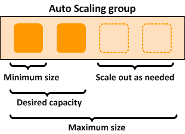

# Load Balancers
- Balances the load across servers or application
- Don’t have to be internet facing or public but in general they are.

## Three type

### Application Load Balancers:
- Best Suited for HTTP and HTTPS  Traffic, Operate at Layer 7 , are intelligent and can create advanced routing based are application for example you changed language to french it load balance across french servers.

### Network Load Balancers:
- Load Balancing TCP requests,
- Extremely performant
- Operate at layer 4. i.e. connection level.
- Maintain ultra load latency.

### Classic Load Balancers
- Legacy elastic load balancers.
- Basic load balancing at most cost effective rate.
- User layer 7 specific features such x-forwarded headers and sticky session.
- But are not intelligent
- Can be used to strict layer 4 balancing for applications that rely on tcp.
- Generally you should use Application Load balancers.
- when application times out ELB will give 504 error.
- When user request comes via classic load balancers the application gets LBs IP
  addresses rather than users IP address , you can use x-forwarded-for header to find users IP.

# Application Load balancers

### Target Group
Your load balancer routes requests to the targets in a target group using the target
group settings that you specify, and performs health checks on the targets using
the health check settings that you specify.

- In Target Group you can create Targets By Instance, IP( For webservers that are not inside AWS and you just do it by public IP        )
  or a lambda.

  # Auto Scaling
mazon EC2 Auto Scaling helps you ensure that you have the correct number of
Amazon EC2 instances available to handle the load for your application

  

  ## Auto Scaling Components
  The following table describes the key components of Amazon EC2 Auto Scaling.

  | Component  	               |   	|
  |----------------------------|---	|
  |   Launch Configuration   	 |  template for its EC2 instances. You can specify information such as the AMI ID, instance type, key pair, security groups, and block device mapping for your instances See [Launch Configuration](https://docs.aws.amazon.com/autoscaling/ec2/userguide/LaunchConfiguration.html)  or [Launch Template](https://docs.aws.amazon.com/autoscaling/ec2/userguide/LaunchTemplates.html)  	|
  |   Auto Scaling Group   	   | Your EC2 instances are organized into groups so that they can be treated as a logical unit for the purposes of scaling and management. When you create a group, you can specify its minimum, maximum, and, desired number of EC2 instances. For more information, see [Auto Scaling Group](https://docs.aws.amazon.com/autoscaling/ec2/userguide/AutoScalingGroup.html)	|

                                                                              --->S3 (Mdeia)
                                                                             |
                                                                |---> AZ1-->EC2-->RDS
                                                                |            |
                                                                |            -->S3 (Mdeia)
                                                                |
User --> Route53 --> AWS --> VPC --> ELB --> Auto Scale Group --|
                                                                |              -->S3 (Mdeia)
                                                                |             |
                                                                |---> AZ1-->EC2-->RDS
                                                                              |
                                                                              -->S3 (Mdeia)

### Autoscaling - Default Termination Policy
The default termination policy is designed to help ensure that your network architecture spans Availability Zones evenly. With the default termination policy, the behavior of the Auto Scaling group is as follows:

1. If there are instances in multiple Availability Zones, **choose the Availability Zone with the most instances and at least one instance that is not protected from scale in**. If there is more than one Availability Zone with this number of instances, choose the Availability Zone with the instances that use the oldest launch configuration.

2. Determine which unprotected instances in the selected Availability Zone use the **oldest launch configuration**. If there is one such instance, terminate it.

3. If there are multiple instances to terminate based on the above criteria, **determine which unprotected instances are closest to the next billing hour**. (This helps you maximize the use of your EC2 instances and manage your Amazon EC2 usage costs.) If there is one such instance, terminate it.

4. **If there is more than one unprotected instance closest to the next billing hour, choose one of these instances at random.**

The following flow diagram illustrates how the default termination policy works:

# Example HA Architecture

###Create HA application

- Create S3 Buckets
  - make them public
  - Create Cloud Front Distribution - For your media S3 buckets
- Create Security Groups Web DMZ
- Create RDS Security Group  to Access you Database (Add Rules in RDS sec group to allow WebDMZ group)
- Create RDS Database
    -use you RDS Sec Group
    - Ensure to see advance settings
- Create Roles to allow s3 to be accessed by EC2 instances

-- Configure EC2
  Backup to S3
  Ec2 instance behind LB
  Update Route53 to

## DR Scenarios

### Pilot Light
The term pilot light is often used to describe a DR scenario in which a minimal version of an environment is always running in the cloud. The idea of the pilot light is an analogy that comes from the gas heater. In a gas heater, a small flame that’s always on can quickly ignite the entire furnace to heat up a house. This scenario is similar to a backup-and-restore scenario.

For example, with AWS you can maintain a pilot light by configuring and running the most critical core elements of your system in AWS. When the time comes for recovery, you can rapidly provision a full-scale production environment around the critical core.

