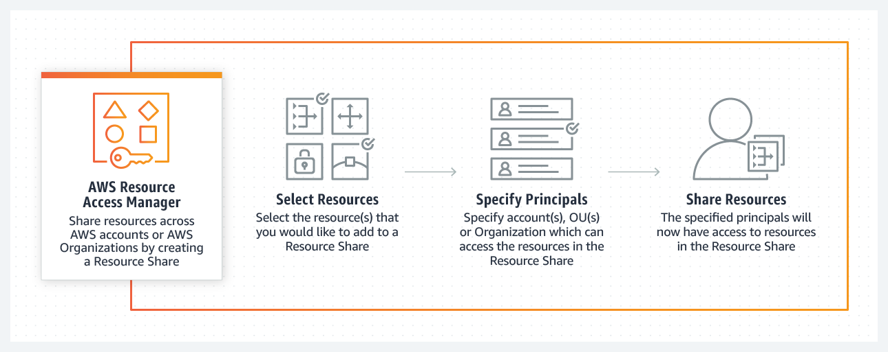

 # Identity and Access Management (IAM)

- Comes Under ID secrutiy and compliance

---

### IAM

Manage user and their level of access to the AWS console and provides

- Centralise control of your AWS account
- Shared access to AWS account
- Permission Granularity
- Identity Federation (including Facebook,Active directory and Linked in)
	 you can connect your IAM to these ID providers
-  Multifactor authentication (MFA)
- Termorary access to users/ devices and services
- Allows you to setup Password rotation policy
- Integrates with many AWS services
- Supports PCI DSS compliance

---

***Users***

- End users or people
***Groups***

- Collection of users consider user group (eg.g HR ,
 fincance, sys admin)
***Roles***

- You can create roles and assign them to AWS resources
	e.g you can create a role for EC instances that can
	access/write to S3.
***Policies***

- Document that defines one or more permissions, you can
	attach a policy to a user group or a role.  
	Policy Document is written in json format.

---

### Notes From Lab1

- You can select your region from top ,
	but not all regions have all the services.
	so in those cases you need to select different regions.
- IAM is a global service and not sepecfic to a region.
IAM user signin link (default is)
	- https://useraccount_number.signin.aws.amazon.com/console
you can edit and change it which will setup new dns name,
	for example in my case it is

	- https://leanmentors.signin.aws.amazon.com/console

---

### What is Root account?
simply email address that you used to sign up to AWS, you will have unlimited access.

- You should only ever login using root account once
	 or twice and setup users groups and
	 roles with limited acces.

---

### Multifactor Authentication (MFA)

- AWS MultiFactor Authentication (MFA) is a simple best practice that adds an extra layer of protection on top of your user name and password.
- With MFA enabled, when a user signs in to an AWS website, they will be prompted for their user name and password (the first factor—what they know), as well as for an authentication code from their AWS MFA device (the second factor—what they have). Taken together, these multiple factors provide increased security for your AWS account settings and resources.

---

### MFA

- You can enable MFA for your AWS account and for individual IAM users you have created under your account.
- MFA can be also be used to control access to AWS service APIs.
- After you've obtained a supported hardware or virtual MFA device AWS does not charge any additional fees for using MFA.

---

### MFA
- Multifactor authentication mandates you to login using
	physical or virtual device.
- If someone finds your email / password they wont'
be able to login.
- MFA adds extra security because it requires users to
	type a unique authentication code from an approved
	authentication device or SMS text message when they
	access AWS websites or services

---

### MFA

Using **Virtual Device** Use your existing smartphone or tablet running any application that supports the open
[TOTP](https://tools.ietf.org/html/rfc6238) standard aka RFC6238 and stands for `Time-Based One-Time Password Algorithm.`

---

### Access

		Users can access using programmatic acccess
		and AWS console  access.
		- Console : using username and password
		- Programatic: using `Access Key Id` and `Secrect Access Key`
			- You will only see **secrect access key** once at the
			  time of creation
			- if you loose it, you will need to deactive the access
			  key and create a new one which will be new
			  access key Id and secrect access

		One user can be setup to use both programtic and console
		access, but to do progrmatic access you can only access
		using access key Id and secret  access key and to
		access console you will need to use username and password.

---

### Groups Based Access

	- A user will inherit permissions from the groups which are
		assigned to him/her
	- however on top of that you can still grant additional
		permission to the user
	- In this way he or she will have more permission as compared
		 to the rest of the members of the group.
	- For example A team lead might be in a developer but
		with additional permissions.
	- Which means you can attach permissions to users or group.

---

### Roles

	Roles are way to grant permissions to the entities
	that you trust.

---

#### What are IAM roles?
		IAM roles are a secure way to
			grant permissions to entities that you trust.
		Examples of entities include the following:

		- IAM user in another account
		- Application code running on an EC2 instance
			that needs to perform actions on AWS resources
		- An AWS service that needs to act on resources
			in your account to provide its features
		- Users from a corporate directory who use
			identity federation with SAML

		IAM roles issue keys that are valid for short durations,
			making them a more secure way to grant access.

---

### Lab 2 - Create a billing Alarm:

	- Receive alerts if your spent for a month is higher
	  than a threshold
	- you enable it from `my billing dashboard`
	- Enable Monitor your changes > receive Billing Alerts
	- To manage billing alerts you use `Cloud Watch` service.
	- Done using cloud watch so AWS Cloud Watch can monitor
	  your account and send email if your spend goes above
	  threshold.

---

### Summary

	- Users
		- End users or people
	- Groups
		- Collection of users consider user group e.g HR, IT etc.
	- Roles
		- You can create roles and assign them to AWS resources
		  e.g you can create a role for EC instances that can
		  access/write to S3.
	- Policies
		-Document that defines one or more permissions, you can
			attach a policy to a user group or a role.  
		-Policy Document is written in json format.

---
### Centrally Managing AWS Accounts

AWS Resource Access Manager (RAM) is a service that enables you to easily and securely share AWS resources with any AWS account or within your AWS Organization. You can share AWS Transit Gateways, Subnets, AWS License Manager configurations, and Amazon Route 53 Resolver rules resources with RAM.

Many organizations use multiple accounts to create administrative or billing isolation, and limit the impact of errors. RAM eliminates the need to create duplicate resources in multiple accounts, reducing the operational overhead of managing those resources in every single account you own. You can create resources centrally in a multi-account environment, and use RAM to share those resources across accounts in three simple steps: create a Resource Share, specify resources, and specify accounts. RAM is available to you at no additional charge.

You can procure AWS resources centrally, and use RAM to share resources such as subnets or License Manager configurations with other accounts. This eliminates the need to provision duplicate resources in every account in a multi-account environment, reducing the operational overhead of managing those resources in every account.

AWS Organizations is an account management service that lets you consolidate multiple AWS accounts into an organization that you create and centrally manage. With Organizations, you can create member accounts and invite existing accounts to join your organization. You can organize those accounts into groups and attach policy-based controls.
---

**Summary**

- IAM is `universal` and deos not apply to regions
- Root account is simply account created when you create AWS
  account
- New users chave no permissions when created
- New users have access key Id and Secrect access keys, you
  can access aws using access key ID and Secret access keys
  using `programtic means` e.g.  command line, APIs/Scrips
  however not using console.
  - accessKey ID and Secret access Key are only visible once,
    so if you loose them you will need to regenerate them ,
    so when you get them save them in a safe location
  - Always setup muti-factor auth for root account
  - Set up passowrd policy (including password rotation policy)
  - User Access allows  Access to all AWS services ,except for
    management of groups and users within IAM.
  - root access is same as administrator access

---

### To Do
	check how to ensure that 100s of users to have same permissions
