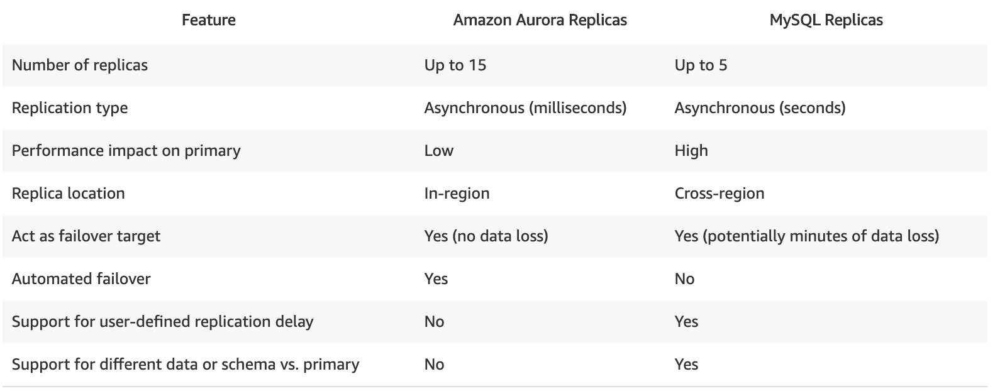

# RDS

#### Limits on number of database engines per RDS instances
Both the Oracle and SQL Server database engines have limits to how many databases that can run per instance. Primarily, this is due to the underlying technology being proprietary and requiring specific licensing to operate. The database engines based on Open Source technology such as Aurora, MySQL, MariaDB or PostgreSQL have no such limits.

### Benefit of Read Replicas
Amazon RDS Read Replicas provide `enhanced performance and durability` for database (DB) instances. This feature makes it easy to `elastically scale` out beyond the capacity constraints of a single DB instance for read-heavy database workloads.

You can create one or more replicas of a given source DB Instance and serve high-volume application read traffic from multiple copies of your data, thereby increasing aggregate read throughput. Read replicas can also be promoted when needed to become standalone DB instances. Read replicas are available in Amazon RDS for MySQL, MariaDB, Oracle and PostgreSQL, as well as Amazon Aurora.

## Amazon Aurora

Amazon Aurora is a `MySQL and PostgreSQL-compatible` relational database built for the cloud, that combines the performance and availability of traditional enterprise databases with the `simplicity` and `cost-effectiveness` of open source databases.

### Benefits
- Amazon Aurora is up to `five times faster than standard MySQL databases` and `three times faster than standard PostgreSQL` databases
- It provides the security, availability, and reliability of commercial databases at `1/10th the cost`.
-Amazon Aurora is `fully managed by Amazon Relational Database Service (RDS)`, which automates time-consuming administration tasks like hardware provisioning, database setup, patching, and backups.

- You no longer need to worry about database management tasks such as hardware provisioning, software patching, setup, configuration, or backups

### Aurora V MySQL

### Aurora Cluster

| Auroa Cluster |
| :------------- |
|       |
| Auroa maintains 6 copies of database across 3 AZ (2 in Each Zone  )|

- Each Aurora DB cluster can have up to s15 Aurora Replicas in addition to the primary DB instance.

### High Availability and Replication

- Amazon Aurora automatically divides your database volume into 10GB segments spread across many disks. Each 10GB chunk of your database volume is replicated six ways, across three Availability Zones. (As Shown above)
- Amazon Aurora is designed to transparently handle the `loss of up to two copies of data without affecting database write availability` and up to `three copies without affecting read availability`.
-  Amazon Aurora storage is also `self-healing`. Data blocks and disks are continuously scanned for errors and repaired automatically.

### Aurora `Reader Endpoints` (Load Balancing)

Amazon Aurora typically involves a cluster of DB instances instead of a single instance. Each connection is handled by a specific DB instance. When you connect to an Aurora cluster, the hostname and port that you specify point to an intermediate handler called an endpoint. Aurora uses the endpoint mechanism to abstract these connections. Thus, you don't have to hardcode all the hostnames or write your own logic for load-balancing and rerouting connections when some DB instances aren't available.

For certain Aurora tasks, different instances or groups of instances perform different roles. For example, the primary instance handles all data definition language (DDL) and data manipulation language (DML) statements. Up to 15 Aurora Replicas handle read-only query traffic.

Using endpoints, you can map each connection to the appropriate instance or group of instances based on your use case. For example, to perform DDL statements you can connect to whichever instance is the primary instance. To perform queries, you can connect to the reader endpoint, with Aurora automatically performing load-balancing among all the Aurora Replicas. For clusters with DB instances of different capacities or configurations, you can connect to custom endpoints associated with different subsets of DB instances. For diagnosis or tuning, you can connect to a specific instance endpoint to examine details about a specific DB instance.

A reader endpoint for an Aurora DB cluster provides load-balancing support for read-only connections to the DB cluster. Use the reader endpoint for read operations, such as queries. By processing those statements on the read-only Aurora Replicas, this endpoint reduces the overhead on the primary instance. It also helps the cluster to scale the capacity to handle simultaneous SELECT queries, proportional to the number of Aurora Replicas in the cluster. Each Aurora DB cluster has one reader endpoint.

If the cluster contains one or more Aurora Replicas, the reader endpoint load-balances each connection request among the Aurora Replicas. In that case, you can only perform read-only statements such as SELECT in that session. If the cluster only contains a primary instance and no Aurora Replicas, the reader endpoint connects to the primary instance. In that case, you can perform write operations through the endpoint.

Hence, the correct answer is to use the built-in Reader endpoint of the Amazon Aurora database.

### Aurora `Cluster Endpoints` (For connecting to cluster **`NOT for`** Load Balancing)

The option that says: Use the built-in Cluster endpoint of the Amazon Aurora database is incorrect because a cluster endpoint (also known as a writer endpoint) simply connects to the current primary DB instance for that DB cluster. This endpoint can perform write operations in the database such as DDL statements, which is perfect for handling production traffic but not suitable for handling queries for reporting since there will be no write database operations that will be sent.

# Amazon Aurora Parallel Query (distribute the computational Load of single query `No Load Balancing` )
Amazon Aurora Parallel Query simply enables Amazon Aurora to push down and distribute the computational load of a single query across thousands of CPUs in Aurora's storage layer. Take note that it does not load balance all of the incoming read requests equally to the two Read Replicas. With Parallel Query, query processing is pushed down to the Aurora storage layer. The query gains a large amount of computing power, and it needs to transfer far less data over the network. In the meantime, the Aurora database instance can continue serving transactions with much less interruption. This way, you can run transactional and analytical workloads alongside each other in the same Aurora database, while maintaining high performance.

The option that says: Create a new Network Load Balancer to evenly distribute the read queries to the Read Replicas of the Amazon Aurora database is incorrect because a Network Load Balancer is not the suitable service/component to use for this requirement since an NLB is primarily used to distribute traffic to servers, not Read Replicas. You have to use the built-in Reader endpoint of the Amazon Aurora database instead.

References:

https://docs.aws.amazon.com/AmazonRDS/latest/AuroraUserGuide/Aurora.Overview.Endpoints.html

https://docs.aws.amazon.com/AmazonRDS/latest/AuroraUserGuide/Aurora.Overview.html

https://aws.amazon.com/rds/aurora/parallel-query/

Check out this Amazon Aurora Cheat Sheet:

https://tutorialsdojo.com/aws-cheat-sheet-amazon-aurora/

### [AURORA FAQs](https://aws.amazon.com/rds/aurora/faqs/?nc=sn&loc=6ss)
