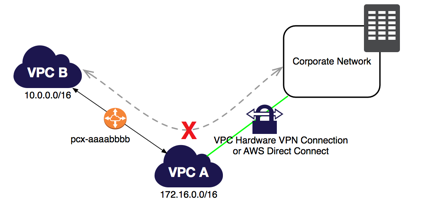

# VPC
Amazon `Virtual Private Cloud (Amazon VPC)` lets you provision a logically isolated section of the AWS Cloud where you can launch AWS resources in a virtual network that you define.

You have `complete control over your virtual networking environment`, including selection of your own `IP address range`, `creation of subnets`, and configuration of `route tables` and `network gateways`. You can use both IPv4 and IPv6 in your VPC for secure and easy access to resources and applications.

### Route Table
`Route Table` contains a set of rules called routes that are used to Determine where the network traffic is routed.

- To Create a private subnet we need to create a route table that is not connected to internet gateway.
- [Good Video on Subnets and how to make a subnet private/public](https://www.youtube.com/watch?v=KNT463WSjjY&t=49s)

### Network ACL

- [Network Access Control List - Good Video](https://www.youtube.com/watch?v=vJzHn24TNQE)
- Works at **`SUBNET LEVEL`**.
- `Lower Number Rule is executed First`, This means lower number order is executed first whatever it allows or denies takes precedence.
- In bound and outbound rules are separately executed
- In Default ACL everything is **`ALLOWED`**
- However when you create `new  NACL` everything is **`DENIED`**
- You specify in your `inbound rules` source `IPs or CIDR range` from where traffic is `ALLOWED to flow in`.
- You specify in your `outbound rules` source `IPs or CIDR range` to where traffic is `ALLOWED to flow out`.

To allow the custom port, you have to change the Inbound Rules in your Security Group to allow traffic coming from the mobile devices.
>Security Groups usually control the list of ports that are allowed to be used by your EC2 instances and the NACLs control which network or list of IP addresses can connect to your whole VPC.

>When you create a security group, it has no inbound rules. By default, a security group includes an outbound rule that allows all outbound traffic. You can remove the rule and add outbound rules that allow specific outbound traffic only. If your security group has no outbound rules, no outbound traffic originating from your instance is allowed.

### Security group
- **`Controls the traffic`** for one or `more instances`
- Changes to security groups are automatically applied instantly to all instance attached to that security group.
- **`In case of security groups all the rules are evaluated`** and then decide what to do.
- In the `default security group` all inbound and outboud traffic is **`ALLOWED`** Just like default NACL.
- When you create a new `security group all inbound traffic is DENIED` just in like when you create new NACL. **However** all outbound traffic is allowed.
- At security group level everything is DENIED, unless you specify ALLOW rule.
- **`There are not DENY RULES AT SECURITY GROUP LEVEL only ALLOW RULES`** So I can only explicitly allow something  in security group rule

##### Questions

* Having just created a new VPC and launching an instance into its public subnet, you realise that you have forgotten to assign a public IP to the instance during creation. What is the simplest way to make your instance reachable from the outside world?*
 -

Although creating a new NIC & associating an EIP also results in your instance being accessible from the internet, it leaves your instance with 2 NICs & 2 private IPs as well as the public address and is therefore not the simplest solution. By default, any user-created VPC subnet WILL NOT automatically assign public IPv4 addresses to instances – the only subnet that does this is the “default” VPC subnets automatically created by AWS in your account.

In a custom VPC with new subnets in each AZ, there is a route that supports communication across all subnets/AZs. Plus a default SG with an allow rule 'All traffic, all protocols, all ports, from anythi

You may have only one internet gateway per VPC.ng using this default SG'.

By default, I am allowed 5 vpcs in each AWS region?

In a VPC an instance does not retain its private IP address.

0.0.0.0/0 would allow ANYONE from ANYWHERE to connect to your instances. This is generally a bad plan. The phrase 'web-facing subnets' does not mean just web servers. It would include any instances in that subnet some of which you may not strangers attacking. You would only allow 0.0.0.0/0 on port 80 or 443 to to connect to your public facing Web Servers, or preferably only to an ELB. Good security starts by limiting public access to only what the customer needs. *Please see the AWS Security whitepaper for complete details.*

# VPN

Amazon VPC offers you the flexibility to fully manage both sides of your Amazon VPC connectivity by creating a VPN connection between your remote network and a software VPN appliance running in your Amazon VPC network. This option is recommended if you must manage both ends of the VPN connection either for compliance purposes or for leveraging gateway devices that are not currently supported by Amazon VPC’s VPN solution.

||
|  :--------------|

| Use this to Explain VPN and VPC    |
| :------------- |
|        |

You can create an `IPsec VPN connection` between your `VPC` and your remote network. On the AWS side of the VPN connection, a `virtual private gateway` provides `two VPN endpoints (tunnels) for automatic failover`. You configure your `customer gateway on the remote side` of the VPN connection. If you have more than one remote network (for example, multiple branch offices), you can create multiple AWS managed VPN connections via your `virtual private gateway` to enable communication between these networks.

With AWS Site-to-Site VPN, you can connect to an Amazon VPC in the cloud the same way you connect to your branches. AWS Site-to-Site VPN establishes secure and private sessions with IP Security (IPSec) and Transport Layer Security (TLS) tunnels.

By default, instances that you launch into a virtual private cloud (VPC) can't communicate with your own network. You can enable access to your network from your VPC by attaching a virtual private gateway to the VPC, creating a custom route table, updating your security group rules, and creating an AWS managed VPN connection.

Although the term VPN connection is a general term, in the Amazon VPC documentation, a VPN connection refers to the `connection between your VPC and your own network`. AWS supports Internet Protocol security (IPsec) VPN connections.

A `customer gateway` is a physical device or software application on your side of the VPN connection.

>**To create a VPN connection**, you must create a customer gateway resource in AWS, which provides information to AWS about your customer gateway device. Next, you have to set up an Internet-routable IP address (static) of the customer gateway's external interface.

The following diagram illustrates single VPN connections. The VPC has an attached virtual private gateway, and your remote network includes a customer gateway, which you must configure to enable the VPN connection. You set up the routing so that any traffic from the VPC bound for your network is routed to the virtual private gateway.

##### Important to Note

 - A VPN connection actually goes through the public Internet, unlike the AWS Direct Connect connection which has a direct and dedicated connection to your on-premises network. So Actually VPN goes over internet over secure channel IPSec whereas direct connect is direct and dedicated.

### Edge to Edge Peering

Edge to Edge Routing Through a Gateway or Private Connection

If either VPC in a peering relationship has one of the following connections, you cannot extend the peering relationship to that connection:

|      |
| :------------- |
| Edge to edge VPN peering is not allowed |

A VPN connection or an AWS Direct Connect connection to a corporate network
An internet connection through an internet gateway
An internet connection in a private subnet through a NAT device
A VPC endpoint to an AWS service; for example, an endpoint to Amazon S3.
(IPv6) A ClassicLink connection. You can enable IPv4 communication between a linked EC2-Classic instance and instances in a VPC on the other side of a VPC peering connection. However, IPv6 is not supported in EC2-Classic, so you cannot extend this connection for IPv6 communication.

For example, if VPC A and VPC B are peered, and VPC A has any of these connections, then instances in VPC B cannot use the connection to access resources on the other side of the connection. Similarly, resources on the other side of a connection cannot use the connection to access VPC B.

### Reserved IP addresses
The first four IP addresses and the last IP address in each subnet CIDR block are not available for you to use, and cannot be assigned to an instance. For example, in a subnet with CIDR block 10.0.0.0/24, the following five IP addresses are reserved:

- `10.0.0.0`  : Network address.
- `10.0.0.1`: Reserved by AWS for the VPC router.
- `10.0.0.2`: Reserved by AWS. The IP address of the DNS server is the base of the VPC network range plus two. For VPCs with multiple CIDR blocks, the IP address of the DNS server is located in the primary CIDR. We also reserve the base of each subnet range plus two for all CIDR blocks in the VPC. For more information, see Amazon DNS Server.
- `10.0.0.3`: Reserved by AWS for future use.
- `10.0.0.255`: Network broadcast address. We do not support broadcast in a VPC, therefore we reserve this address.

### Keeping the `On Premises` IP Address range
You can bring part or all of your public IPv4 address range from your on-premises network to your AWS account. You continue to own the address range, but AWS advertises it on the Internet. After you bring the address range to AWS, it appears in your account as an address pool. You can create an Elastic IP address from your address pool and use it with your AWS resources, such as EC2 instances, NAT gateways, and Network Load Balancers. This is also called **`"Bring Your Own IP Addresses (BYOIP)"`**.

To ensure that only you can bring your address range to your AWS account, you must authorize Amazon to advertise the address range and provide proof that you own the address range.

**A Route Origin Authorization (ROA)** is a document that you can create through your Regional internet registry (RIR), such as the American Registry for Internet Numbers (ARIN) or Réseaux IP Européens Network Coordination Centre (RIPE). `It contains the address range, the ASNs that are allowed to advertise the address range, and an expiration date.`

>The ROA authorizes Amazon to advertise an address range under a specific AS number. However, it does not authorize your AWS account to bring the address range to AWS. To authorize your AWS account to bring an address range to AWS, you must publish a self-signed X509 certificate in the RDAP remarks for the address range. The certificate contains a public key, which AWS uses to verify the authorization-context signature that you provide. You should keep your private key secure and use it to sign the authorization-context message.

### Calculating available addresses in CIDR Range

To calculate the total number of IP addresses of a given CIDR Block, you simply need to follow the 2 easy steps below. Let's say you have a CIDR block /27:

1. Subtract 32 with the mask number :

(32 - 27) = **5**

2. Raise the number 2 to the power of the answer in Step #1 :

**2^ 5** = (2 * 2 * 2 * 2 * 2) = 32

The answer to Step #2 is the total number of IP addresses available in the given CIDR netmask. Don't forget that in AWS, **the first 4 IP addresses and the last IP address in each subnet CIDR block are not available for you to use, and cannot be assigned to an instances**.

So you will have availble 27 IP Addresses for this case 

`The allowed block size is between a /28 netmask and /16 netmask.`
