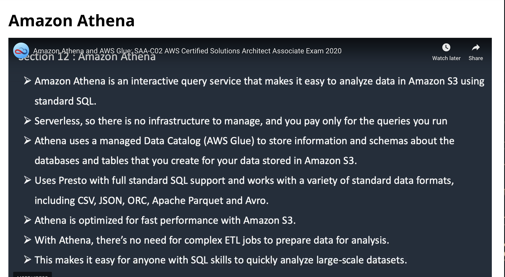
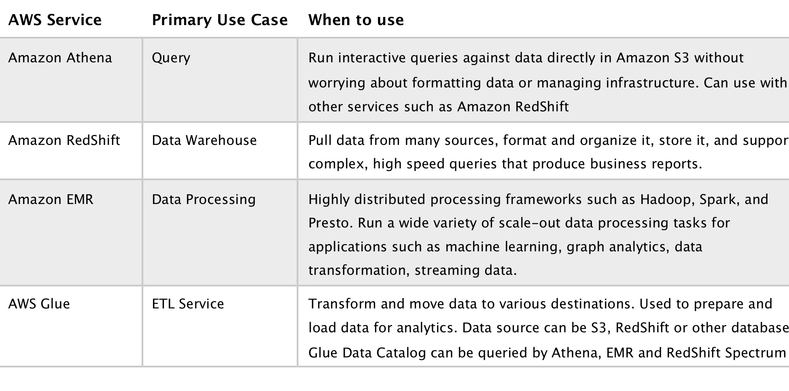

# Amazon Athena

- Amazon Athena is an interactive query service that makes it easy to analyze data in Amazon S3 using standard SQL.
- Athena is serverless, so there is no infrastructure to manage, and you pay only for the queries that you run.
- Athena is easy to use – simply point to your data in Amazon S3, define the schema, and start querying using standard SQL.
- Amazon Athena uses Presto with full standard SQL support and works with a variety of standard data formats, including CSV, JSON, ORC, Apache Parquet and Avro.
- While Amazon Athena is ideal for quick, ad-hoc querying and integrates with Amazon QuickSight for easy visualization, it can also handle complex analysis, including large joins, window functions, and arrays.
- Amazon Athena uses a managed Data Catalog to store information and schemas about the databases and tables that you create for your data stored in Amazon S3.
- With Amazon Athena, you don’t have to worry about managing or tuning clusters to get fast performance.
- Athena is optimized for fast performance with Amazon S3.
- Athena automatically executes queries in parallel, so that you get query results in seconds, even on large datasets.
- Most results are delivered within seconds.
- With Athena, there’s no need for complex ETL jobs to prepare data for analysis.
- This makes it easy for anyone with SQL skills to quickly analyze large-scale datasets.
- Athena is out-of-the-box integrated with AWS Glue Data Catalog, allowing you to create a unified metadata repository across various services, crawl data sources to discover schemas and populate your Catalog with new and modified table and partition definitions, and maintain schema versioning.
- You can also use Glue’s fully-managed ETL capabilities to transform data or convert it into columnar formats to optimize cost and improve performance.

