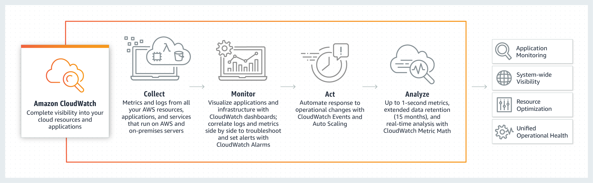

# CloudWatch (Monitors Performance)

Amazon CloudWatch is a `monitoring and observability` service built for `DevOps engineers, developers, site reliability engineers (SREs), and IT managers`. CloudWatch provides you with data and `actionable insights` to monitor your applications, respond to system-wide `performance changes, optimize resource utilization, and get a unified view of operational` health. CloudWatch collects `monitoring and operational data` in the form of `logs, metrics, and events, providing you with a unified view of AWS resources, applications, and services that run on AWS and on-premises servers. You can use CloudWatch to detect anomalous behavior` in your environments, `set alarms, visualize logs and metrics `side by side, `take automated actions, troubleshoot issues, and discover insights` to keep your applications srunning smoothly.

## Benefits

- Observability on a single platform across applications and infrastructure
- Easiest way to collect metrics in `AWS` and `on-premises`
- Improve `operational performance` and resource optimization
- Derive `actionable insights` from logs

## How CloudWatch Works?

- Can monitor AWS well as your applications that run on AWS.
- Default monitoring period is 5 minutes, but you can change it to 1 Minute.
- Can also create cloud watch alarms which trigger notifications and we did that when we created a billing.
-

### EC2 Metrics
Ec2 Metrics available in CloudWatch
- CPUUtilization
- DiskReadOps
- DiskReadOps
- DiskReadBytes
- DiskReadBytes
- NetworkIn
- NetworkOut
- NetworkPacketsIn
- NetworkPacketsOut

CloudWatch has available Amazon EC2 Metrics for you to use for monitoring CPU utilization, Network utilization, Disk performance, and Disk Reads/Writes.

In case that you need to monitor the below items, you need to prepare a custom metric using a Perl or other shell script, as there are no ready to use metrics for these:

- Memory utilization
- disk swap utilization
- disk space utilization
- page file utilization
- log collection

`Take note that there is a multi-platform CloudWatch agent which can be installed on both Linux and Windows-based instances. You can use a single agent to collect both system metrics and log files from Amazon EC2 instances and on-premises servers.` This agent supports both Windows Server and Linux and enables you to select the metrics to be collected, including sub-resource metrics such as per-CPU core. It is recommended that you use the new agent instead of the older monitoring scripts to collect metrics and logs.
