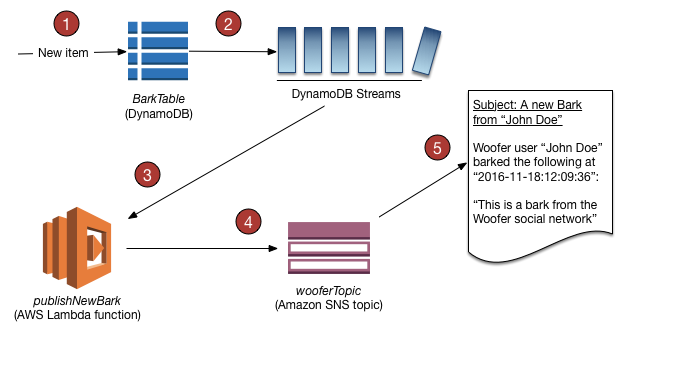

# Dynamo DB

## Durability
- Dynamo DB is `replicated across multiple AZs`.

DynamoDB tables are `schemaless, except for the primary key`, so the items in a table can all have different attributes, sizes, and data types.

### Charges
- Charged for provisioning read and write capacity and the storage of data within DynamoDB
- **`NOT charged`** for the transfer of data into DynamoDB, providing you stay within a single region (if you cross regions, you will be charged at both ends of the transfer.

### DynamoDB Streams

Amazon DynamoDB is integrated with AWS Lambda so that you can create triggers—pieces of code that automatically respond to events in DynamoDB Streams. With triggers, you can build applications that react to data modifications in DynamoDB tables.

If you enable **`DynamoDB Streams`** on a table, you can associate the stream ARN with a Lambda function that you write. Immediately after an item in the table is modified, a new record appears in the table's stream. AWS Lambda polls the stream and invokes your Lambda function synchronously when it detects new stream records.

You can create a Lambda function which can perform a specific action that you specify, such as sending a notification or initiating a workflow. For instance, you can set up a Lambda function to simply copy each stream record to persistent storage, such as EFS or S3, to create a permanent audit trail of write activity in your table.

### Choosing Right Cardinality of MongoDB
https://aws.amazon.com/blogs/database/choosing-the-right-dynamodb-partition-key/
