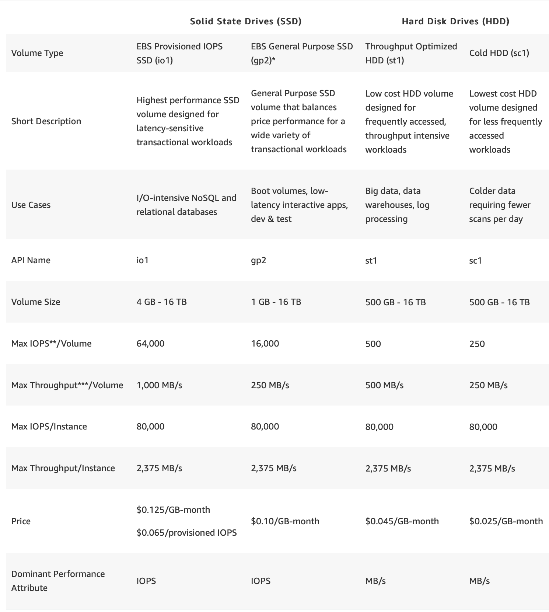

# EBS

## Volume Types

- `Only EBS-backed instances can be stopped and restarted`.
- Remember that an `instance store-backed instance can only be rebooted` or terminated and its data will be erased if the EC2 instance is terminated.
- If you stopped an `EBS-backed EC2 instance`, the volume is preserved but the `data in any attached Instance store` volumes will be erased. (Implies that EBS-Backed instance can have instance store volumes attached it.)

### Backups     
- One way to take EBS backups is Snapshots (incremental and complete)
##### Automating EBS Backups
You can use **`Amazon Data Lifecycle Manager (Amazon DLM)`** to automate the creation, retention, and deletion of snapshots taken to back up your Amazon EBS volumes. Automating snapshot management helps you to:

- Protect valuable data by enforcing a regular backup schedule.
- Retain backups as required by auditors or internal compliance.
- Reduce storage costs by deleting outdated backups.

>Combined with the monitoring features of Amazon CloudWatch Events and AWS CloudTrail, **Amazon DLM provides a complete backup solution for EBS volumes at no additional cost.** Hence, Option 4 is the correct answer as it is the **fastest and cost-effective solution in providing an automated way of backing up your EBS volumes**.

### Availability Issues with EBS

When you create an EBS volume in an Availability Zone, **it is automatically replicated within that zone only to prevent data loss due to a failure of any single hardware component**. After you create a volume, you can attach it to any EC2 instance in the same Availability Zone.

**So if AZ is out of service, your EBS volume will not be able tolerate that.**

### Taking Backup of EBS Volumes Steps:

Remember that since the instance is using a RAID configuration, the snapshot process is different. You should stop all I/O activity of the volumes before creating a snapshot.  

- Stop all applications from writing to the RAID array.
- Flush all caches to the disk.
- Confirm that the associated EC2 instance is no longer writing to the RAID array by taking actions such as freezing the file system, unmounting the RAID array, or even shutting down the EC2 instance.
-   After taking steps to halt all disk-related activity to the RAID array, take a snapshot of each EBS volume in the array.

When you take a snapshot of an attached Amazon EBS volume that is in use, the snapshot excludes data cached by applications or the operating system. For a single EBS volume, this is often not a problem. However, when cached data is excluded from snapshots of multiple EBS volumes in a RAID array, restoring the volumes from the snapshots can degrade the integrity of the array.

When creating snapshots of EBS volumes that are configured in a RAID array, it is critical that there is no data I/O to or from the volumes when the snapshots are created. RAID arrays introduce data interdependencies and a level of complexity not present in a single EBS volume configuration.

### Health Checks

Volume status checks are automated tests that run every 5 minutes and return a pass or fail status. You can view the results of volume status checks to identify any impaired volumes and take any necessary actions.

- If all checks pass, the status of the volume is `ok`.  
- If a check fails, the status of the volume is `impaired`.
- If the volume is severely degraded or the volume performance is well below expectations, then the status is `warning`.
- If the status is `insufficient-data`, the checks may still be in progress on the volume.
