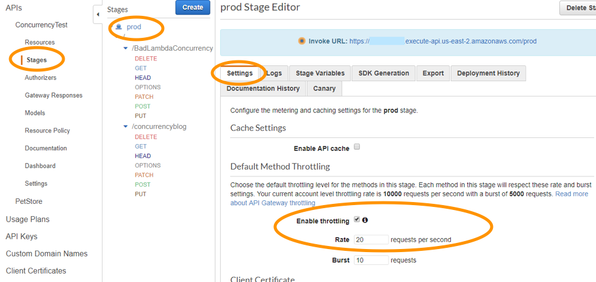

# APIGateway
Amazon API Gateway is a fully managed service that makes it easy for developers to `publish, maintain, monitor, and secure APIs at any scale`. With a few clicks in the AWS Management Console, you can create an API that acts as a **`“front door”`** for applications to access data, business logic, or functionality from your `back-end services, such as applications running on Amazon Elastic Compute Cloud (Amazon EC2), Amazon Elastic Container Service (Amazon ECS) or AWS Elastic Beanstalk, code running on AWS Lambda, or any web application.` Since it can use AWS Lambda, you can run your APIs without servers.

`Amazon API Gateway handles all of the tasks involved in accepting and processing up to hundreds of thousands of concurrent API calls, including traffic management, authorization and access control, monitoring, and API version management.`

### Pricing
- Amazon API Gateway has no minimum fees or startup costs.
- For HTTP APIs and REST APIs, you pay only for the API calls you receive and the amount of data transferred out.
- For WebSocket APIs, you pay only for messages sent and received and for the time a user/device is connected to the WebSocket API.

### Throttling
Amazon API Gateway provides `throttling at multiple levels including global and by service call. Throttling limits can be set for standard rates and bursts.`

**For example**, API owners can set a rate limit of 1,000 requests per second for a specsific method in their REST APIs, and also configure Amazon API Gateway to handle a burst of 2,000 requests per second for a few seconds. Amazon API Gateway tracks the number of requests per second.

- `Any request over the limit will receive a 429 HTTP response`. The client SDKs generated by Amazon API Gateway retry calls automatically when met with this response. Hence, enabling throttling limits and result caching in API Gateway is the correct answer.

`You can add caching to API calls by provisioning an Amazon API Gateway cache and specifying its size in gigabytes`. The cache is provisioned for a specific stage of your APIs. This improves performance and reduces the traffic sent to your back end. `Cache settings allow you to control the way the cache key is built and the time-to-live (TTL) of the data stored for each method. Amazon API Gateway also exposes management APIs that help you invalidate the cache for each stage.`

