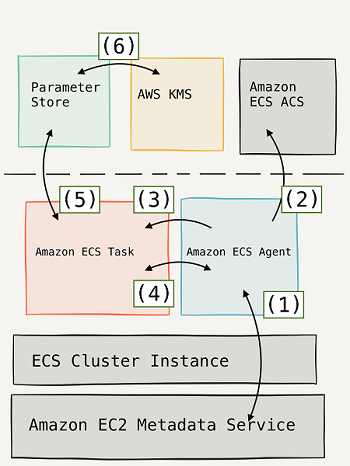

# Amazon ECS
Amazon Elastic Container Service (Amazon ECS) is a fully managed container orchestration service.

- ECS is a great choice to run containers for several reasons. First, you can choose to run your ECS clusters using AWS Fargate, which is serverless compute for containers. Fargate removes the need to provision and manage servers, lets you specify and pay for resources per application, and improves security through application isolation by design.
- Second, ECS is used extensively within Amazon to power services such as Amazon SageMaker, AWS Batch, Amazon Lex, and Amazon.com’s recommendation engine, ensuring ECS is tested extensively for security, reliability, and availability.

### Sensitive Data in ECS

Amazon ECS enables you to inject sensitive data into your containers by storing your sensitive data in either **`AWS Secrets Manager secrets`** or AWS **`Systems Manager Parameter`** Store parameters and then referencing them in your container definition. This feature is supported by tasks using both the EC2 and Fargate launch types.

Secrets can be exposed to a container in the following ways:

- To inject sensitive data into your containers as environment variables, use the secrets container definition parameter.

- To reference sensitive information in the log configuration of a container, use the secretOptions container definition parameter.

Within your container definition, specify `secrets` with the name of the environment variable to set in the container and the full ARN of either the Secrets Manager secret or Systems Manager Parameter Store parameter containing the sensitive data to present to the container. The parameter that you reference can be from a different Region than the container using it, but must be from within the same account.

https://docs.aws.amazon.com/AmazonECS/latest/developerguide/specifying-sensitive-data.html

https://aws.amazon.com/blogs/mt/the-right-way-to-store-secrets-using-parameter-store/
