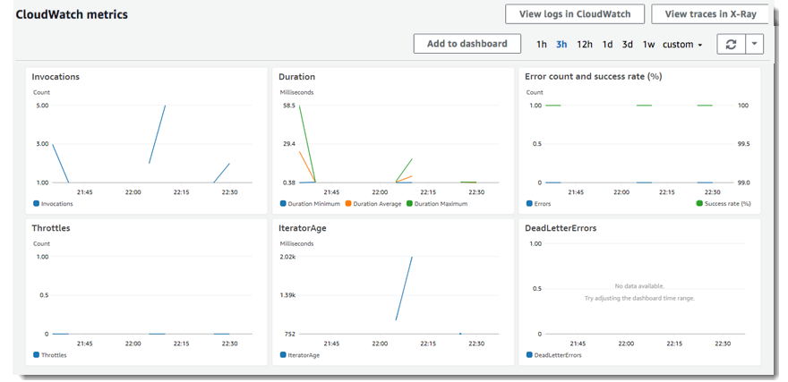
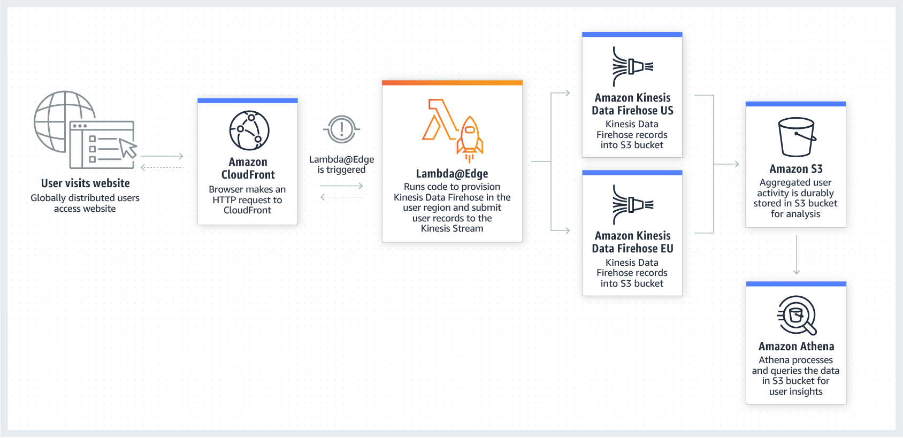
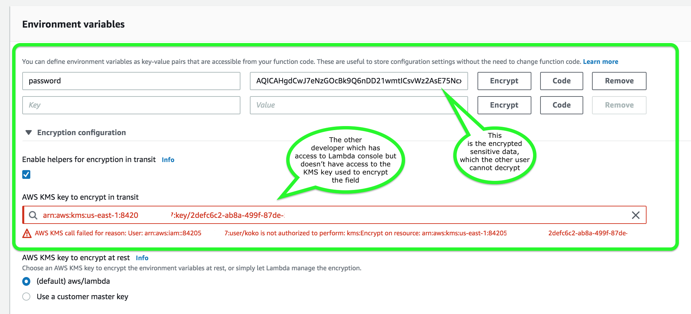

#  AWS Lambda

### Monitoring
AWS Lambda `automatically monitors functions on your behalf, reporting metrics through Amazon CloudWatch`. These metrics include:

- Total invocation requests
- Latency
- Error rates

The throttles, Dead Letter Queues errors and Iterator age for stream-based invocations are also monitored.

You can monitor metrics for Lambda and view logs by using the Lambda console, the CloudWatch console, the AWS CLI, or the CloudWatch API.

**AWS Lambda Metrics in  CloudWatch**

### Lambda@Edge
`Lambda@Edge is a feature of Amazon CloudFront that lets you run code closer to users of your application, which improves performance and reduces latency`. With Lambda@Edge, you don't have to provision or manage infrastructure in multiple locations around the world. You pay only for the compute time you consume - there is no charge when your code is not running.

`With Lambda@Edge, you can enrich your web applications by making them globally distributed and improving their performance — all with zero server administration`. Lambda@Edge runs your code in response to events generated by the Amazon CloudFront content delivery network (CDN). Just upload your code to AWS Lambda, which takes care of everything required to run and scale your code with high availability at an AWS location closest to your end user.

By using Lambda@Edge and Kinesis together, you can process real-time streaming data so that you can track and analyze globally-distributed user activity on your website and mobile applications, including clickstream analysis.

### Encrypting Environment Variables on Lambda

When you create or update Lambda functions that use environment variables, `AWS Lambda encrypts them using the AWS Key Management Service`. When your Lambda function is invoked, those values are decrypted and made available to the Lambda code.

> The first time you create or update Lambda functions that use environment variables in a region, a default service key is created for you automatically within AWS KMS. This key is used to encrypt environment variables. However, `if you wish to use encryption helpers and use KMS to encrypt environment variables after your Lambda function is created, you must create your own AWS KMS key and choose it instead of the default key. The default key will give errors when chosen.`

>` Creating your own key gives you more flexibility, including the ability to create, rotate, disable, and define access controls, and to audit the encryption keys used to protect your data.`

