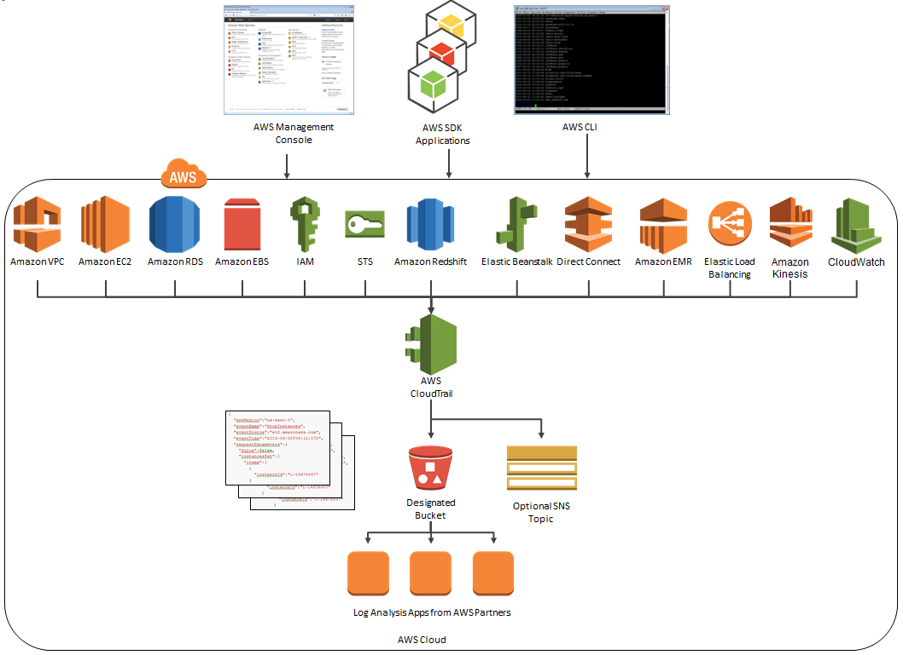

# Cloud Trail
AWS CloudTrail is a service that enables governance, compliance, operational auditing, and risk auditing of your AWS account. With CloudTrail, you can log, continuously monitor, and retain account activity related to actions across your AWS infrastructure.

CloudTrail provides event history of your AWS account activity, `including actions taken through the AWS Management Console, AWS SDKs, command line tools, API calls, and other AWS services`. This event history simplifies security analysis, resource change tracking, and troubleshooting.

