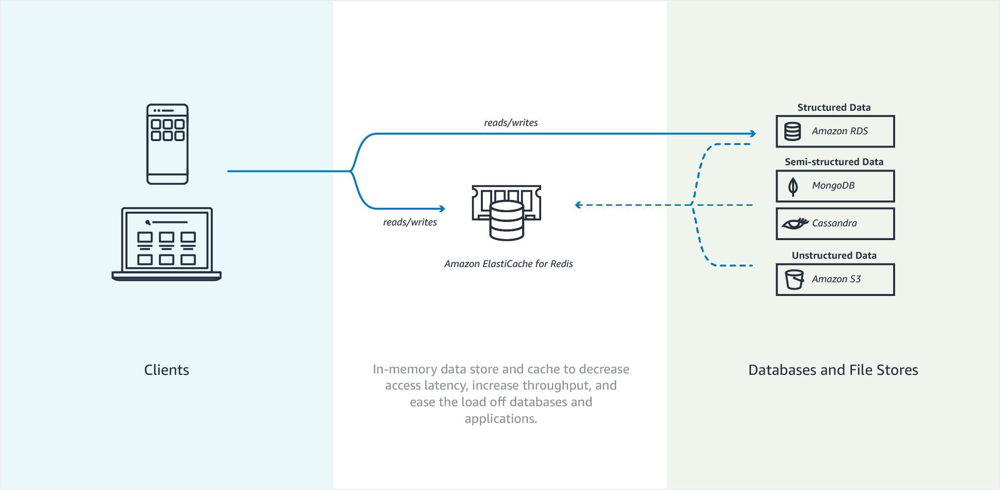

#ElastiCache
ElastiCache improves the performance of your database `through caching query results`.

- The primary purpose of an in-memory `key-value store is to provide ultra-fast (submillisecond latency) and inexpensive access to copies of data`.
- Most data stores have areas of data that are frequently accessed but seldom updated.
- Additionally, `querying a database is always slower and more expensive than locating a key in a key-value pair cache`.
- Some database queries are especially expensive to perform, for example, queries that involve joins across multiple tables or queries with intensive calculations.

- `By caching such query results, you pay the price of the query once` and then are `able to quickly retrieve the data multiple times without having to re-execute the query`.

