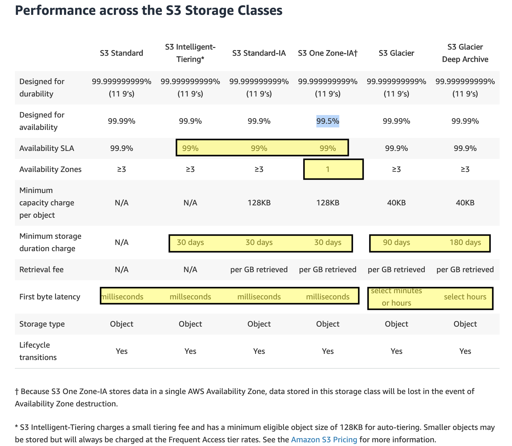

# S3

### Access Logging
Server access logging provides detailed records for the requests that are made to a bucket. Server access logs are useful for many applications. For example, access log information can be useful in security and access audits. It can also help you learn about your customer base and understand your Amazon S3 bill.

Each access log record provides details about a single access request, such as:
- The requester
- bucket name
- request time
- request action
- response status

### Storage Classes
There are six S3 storage classes.

- S3 Standard (`durable`, `immediately available`, `frequently accessed`).
- S3 Intelligent-Tiering (`automatically moves data to the most cost-effective tier`).
- S3 Standard-IA (`durable`, `immediately available`, infrequently accessed).
- S3 One Zone-IA (`lower cost` for infrequently accessed data with `less resilience`).
S3 Glacier (archived data, `retrieval times in minutes or hours`).
S3 Glacier Deep Archive (`lowest cost storage class for long term retention`).

