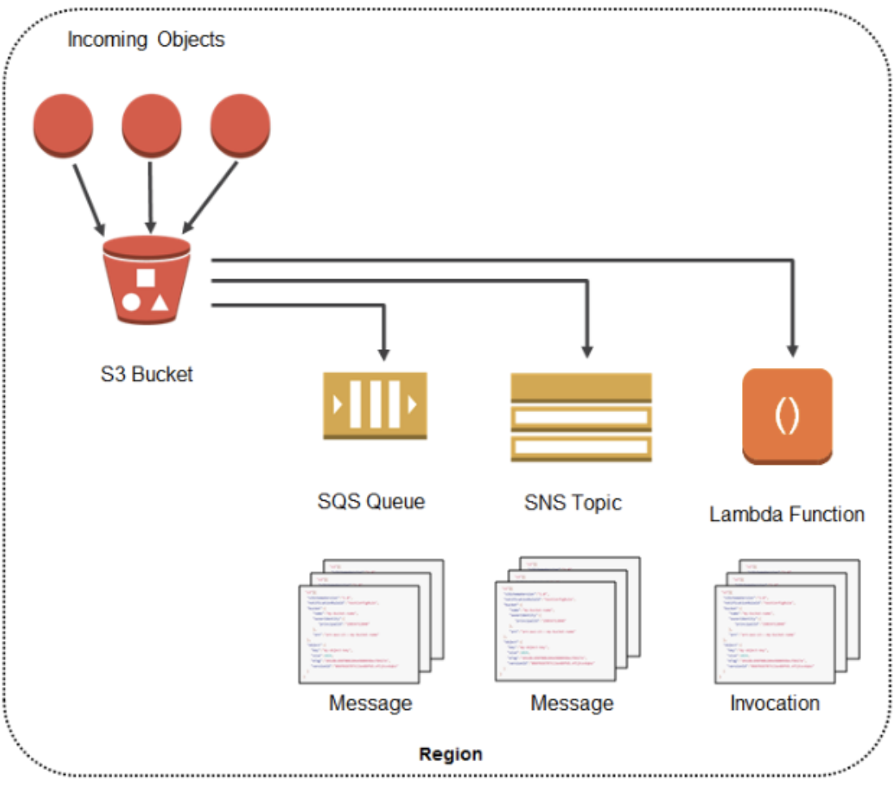
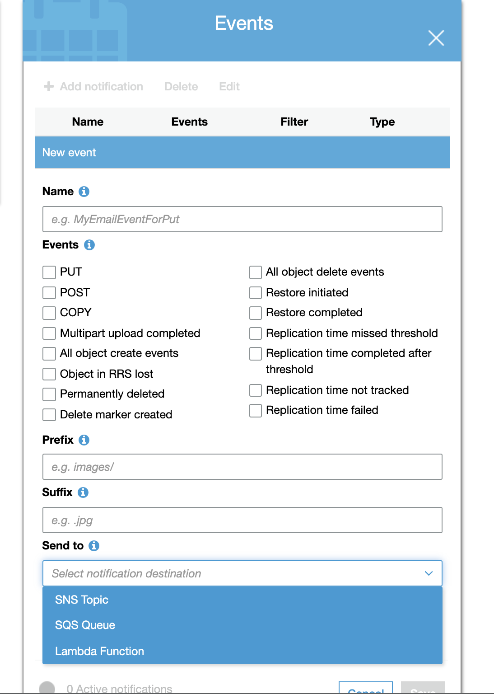
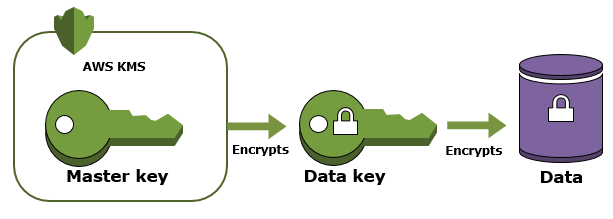

# S3

### Access Logging
Server access logging provides detailed records for the requests that are made to a bucket. Server access logs are useful for many applications. For example, access log information can be useful in security and access audits. It can also help you learn about your customer base and understand your Amazon S3 bill.

Each access log record provides details about a single access request, such as:
- The requester
- bucket name
- request time
- request action
- response status

### Storage Classes
There are six S3 storage classes.

- S3 Standard (`durable`, `immediately available`, `frequently accessed`).
- S3 Intelligent-Tiering (`automatically moves data to the most cost-effective tier`).
- S3 Standard-IA (`durable`, `immediately available`, infrequently accessed).
- S3 One Zone-IA (`lower cost` for infrequently accessed data with `less resilience`).
S3 Glacier (archived data, `retrieval times in minutes or hours`).
S3 Glacier Deep Archive (`lowest cost storage class for long term retention`).

### S3 Notifications

**S3 notifications Can be sent to SQS queue, a lambda or SNS**

## Data Protection

Data protection refers to protecting data while in-transit (as it travels to and from Amazon S3) and at rest (while it is stored on disks in Amazon S3 data centers). You can protect data in transit by using SSL or by using client-side encryption. You have the following options for protecting data at rest in Amazon S3:
- Server Side Encryption (SSE)
- Client Side Encryption (CSE)

### Use Server-Side Encryption
 You request Amazon S3 to encrypt your object before saving it on disks in its data centers and decrypt it when you download the objects.

- Use Server-Side Encryption with Amazon S3-Managed Keys (SSE-S3)
- Use Server-Side Encryption with AWS KMS-Managed Keys (SSE-KMS)
- Use Server-Side Encryption with Customer-Provided Keys (SSE-C)

### Use Client-Side Encryption
 You can encrypt data client-side and upload the encrypted data to Amazon S3. In this case, you manage the encryption process, the encryption keys, and related tools.

- Use Client-Side Encryption with AWS KMS–Managed Customer Master Key (CMK)
- Use Client-Side Encryption Using a Client-Side Master Key

#### Server-Side Encryption with Amazon S3-Managed Keys (SSE-S3)

When you use Server-Side Encryption with Amazon S3-Managed Keys (SSE-S3):
-  each object is encrypted with a `unique key`.
- As an `additional safeguard`, it encrypts the key itself with a master key that it regularly rotates.
- Amazon S3 server-side encryption uses one of the strongest block ciphers available, 256-bit Advanced Encryption Standard (AES-256), to encrypt your data

#### Server-Side Encryption with Customer Master Keys (CMKs) Stored in AWS Key Management Service (SSE-KMS)

- similar to SSE-S3, but with some `additional benefits` and `charges` for using this service.
- There are separate permissions for the use of a CMK that provides added protection against unauthorized access of your objects in Amazon S3.
-  SSE-KMS also provides you with an `audit trail` that shows when your CMK was used and by whom.
- Additionally, you can create and manage customer managed CMKs or use AWS managed CMKs that are `unique to you, your service, and your Region`.

#### Server-Side Encryption with Customer-Provided Keys (SSE-C)

- Customer manages the `encryption keys` and
- Amazon S3 manages the `encryption`, as it writes to disks, and `decryption`, when you access your objects.

### Proivisioned Capcity and Expedited retrieval

**Expedited retrievals allow you to quickly access your data when occasional urgent requests for a subset of archives are required**. For all but the largest archives (250 MB+), data accessed using Expedited retrievals are typically `made available within 1–5 minutes`. `Provisioned Capacity ensures that retrieval capacity for Expedited retrievals is available when you need it.`

To make an Expedited, Standard, or Bulk retrieval, set the Tier parameter in the Initiate Job (POST jobs) REST API request to the option you want, or the equivalent in the AWS CLI or AWS SDKs. If you have purchased provisioned capacity, then all expedited retrievals are automatically served through your provisioned capacity.

Provisioned capacity ensures that your retrieval capacity for expedited retrievals is available when you need it. Each unit of capacity provides that at least three expedited retrievals can be performed every five minutes and provides up to 150 MB/s of retrieval throughput. You should purchase provisioned retrieval capacity if your workload requires highly reliable and predictable access to a subset of your data in minutes. Without provisioned capacity Expedited retrievals are accepted, except for rare situations of unusually high demand. However, if you require access to Expedited retrievals under all circumstances, you must purchase provisioned retrieval capacity.

### S3 Limits

- Largest object that can be uploaded in a **`single PUT`** is 5 GB and not 5 TB.
- Remember that the upload limit depends on whether you upload an object using a `single PUT` operation or via `Multipart Upload`.
- **`The largest object that can be uploaded in a single PUT is 5 GB`**. Please take note the phrase **`"... in a single PUT"`**.
- If you are using the **`multipart upload API, then the limit is 5 TB`**.

### Compliance
An Amazon S3 Glacier (Glacier) vault can have one resource-based vault access policy and one `Vault Lock policy` attached to it. A Vault Lock policy is a vault access policy that you can lock. Using a Vault Lock policy can help you enforce regulatory and compliance requirements. Amazon S3 Glacier provides a set of API operations for you to manage the Vault Lock policies.

As an example of a `Vault Lock policy`, suppose that you are required to retain archives for one year before you can delete them. To implement this requirement, you can create a `Vault Lock policy that denies users permissions to delete an archive until the archive has existed for one year`. You can test this policy before locking it down. After you lock the policy, the policy becomes immutable. For more information about the locking process, see Amazon S3 Glacier Vault Lock. If you want to manage other user permissions that can be changed, you can use the vault access policy

# Encryption

Server-side encryption is the encryption of data at its destination by the application or service that receives it. AWS Key Management Service (AWS KMS) is a service that combines secure, highly available hardware and software to provide a key management system scaled for the cloud. Amazon S3 uses AWS KMS customer master keys (CMKs) to encrypt your Amazon S3 objects. SSE-KMS encrypts only the object data. Any object metadata is not encrypted. If you use customer-managed CMKs, you use AWS KMS via the AWS Management Console or AWS KMS APIs to centrally create encryption keys, define the policies that control how keys can be used, and audit key usage to prove that they are being used correctly. You can use these keys to protect your data in Amazon S3 buckets.

`A customer master key (CMK)` is a logical representation of a master key. The CMK includes metadata, such as the key ID, creation date, description, and key state. The CMK also contains the key material used to encrypt and decrypt data. You can use a CMK to encrypt and decrypt up to 4 KB (4096 bytes) of data. **`Typically, you use CMKs to generate, encrypt, and decrypt the data keys that you use outside of AWS KMS to encrypt your data. This strategy is known as envelope encryption`**.

You have three mutually exclusive options depending on how you choose to manage the encryption keys:

Use Server-Side Encrayption with Amazon `S3-Managed Keys (SSE-S3) – Each object is encrypted with a unique key`. As an additional safeguard, it encrypts the key itself with a master key that it regularly rotates. Amazon S3 server-side encryption uses one of the strongest block ciphers available, `256-bit Advanced Encryption Standard (AES-256)`, to encrypt your data.

Use **`Server-Side Encryption with Customer Master Keys (CMKs) Stored in AWS Key Management Service (SSE-KMS)`** – Similar to SSE-S3, but with some additional benefits and charges for using this service. There are separate permissions for the use of a CMK that provid es added protection against unauthorized access of your objects in Amazon S3. `SSE-KMS also provides you with an audit trail that shows when your CMK was used and by whom. Additionally, you can create and manage customer-managed CMKs or use AWS managed CMKs that are unique to you, your service, and your Region`.

**Use Server-Side Encryption with Customer-Provided Keys (SSE-C)** – You i.e. the customer manage the encryption keys and Amazon S3 manages the encryption, as it writes to disks, and decryption when you access your objects.

In the scenario, the company needs to store financial files in AWS which are accessed every week and the solution should use envelope encryption. This requirement can be fulfilled by using an Amazon S3 configured with Server-Side Encryption with AWS KMS-Managed Keys (SSE-KMS). Hence, using Amazon S3 to store the data and configuring Server-Side Encryption with AWS KMS-Managed Keys (SSE-KMS) are the correct answers.

Using Amazon S3 Glacier Deep Archive to store the data is incorrect because although this provides the most cost-effective storage solution, it is not the appropriate service to use if the files being stored are frequently accessed every week.

>
 With Server-Side Encryption with Customer-Provided Keys (SSE-C) and configuring Server-Side Encryption with Amazon S3-Managed Keys (SSE-S3) although you can configure automatic key rotation, these two do not provide you with an audit trail that shows when your CMK was used and by whom, unlike Server-Side Encryption with AWS KMS-Managed Keys (SSE-KMS).
